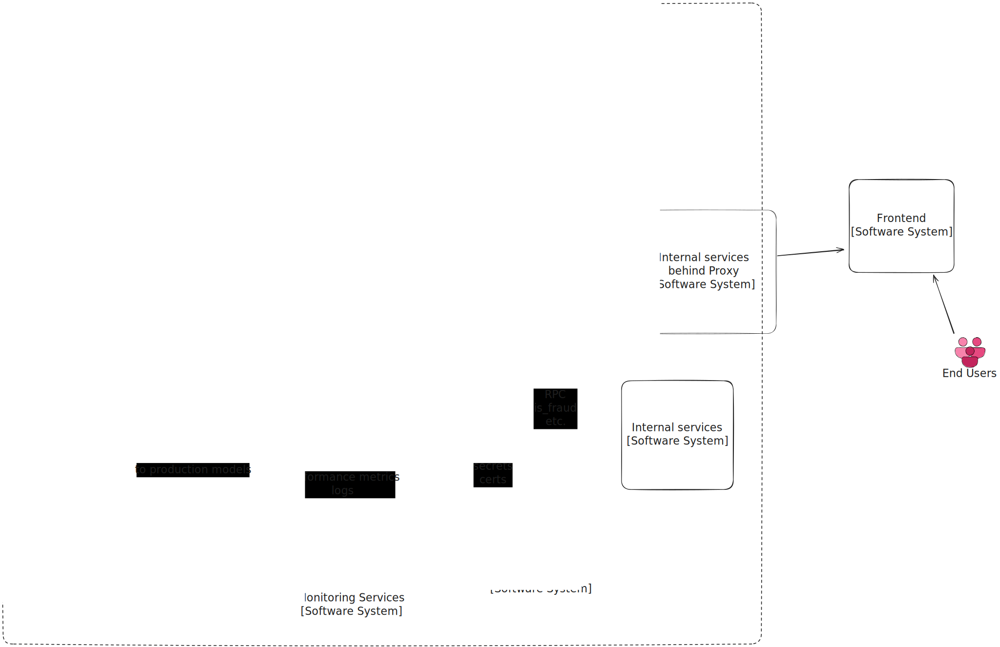
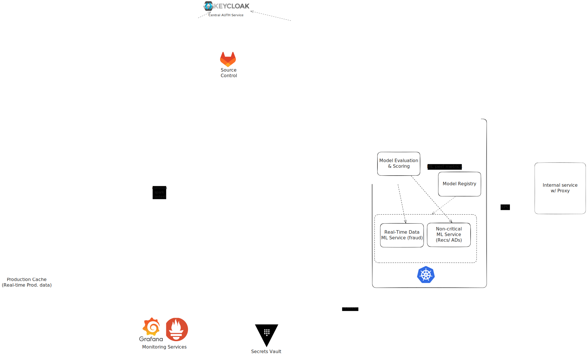

# ML Infrastructure:

## Func Reqs:
* Support Notebook-based experimentation
* Support defining and running ML pipelines
* ML teams must be able to train models using both local and infrastructure compute.
* Model versioning and tracking
* Support deploying models to production as APIs/Services
* ML teams must have access to curated datasets from a feature store.
* User and access management
* The platform must track model performance and operational metrics.
* Handle users with no prior data

## Non-Func Reqs:
* The system must support multiple teams and scale horizontally.
* Pipelines and services must recover gracefully from failures.
* Data must be encrypted in transit and at rest; access must be auditable.
* The system must offer a simple and unified UI for ML workflows.
* Should use GPU & embeddings to mitigate latency
* Logs and metrics must be centralized and queryable for debugging and analysis.

### Personal context:
Before design started I have thought about what type of service am I building.
I've compiled this list of options:
1) Real-time w/ watch time as main metric - like YouTube
2) Not real-time w/ watch time as main metric - like Netflix
3) Real-time w/ click as main metric - like Google AD recommendations
4) Undefined about real-time w/ sells as main metric - like Amazon store
5) Real-time w/ watch (listen) time as main metric - like Yandex Music

Given how lots of big tech company is developing some kind of ML related project, I've decided to try to design such system infra.

I have chosen to do a Platform for ML/AI teams so that they can experiment & develop their projects.

## Design

We will assume that there are other systems set in stone. Perhaps on cloud or local, so I have chosen only Open-Source technologies.

What systems I assume already there:
- A datalake w/ S3 compatible storage. (it can be a HDFS, and then we can move Spark to it, or Iceberg so we can make data ret. faster)
- Kafka to pull events for event-driven ML services
- Version Control System ie Git
- Prod. Caches if we require to send inputs immediately to our ML production models.
- Centralized Secret Store to get Certificates & Secrets with audits.
- Monitoring (eg Prometheus, Graphana, etc.) to send from stdout (& get alert if something is going south)
- Other company services/consumers for our models

